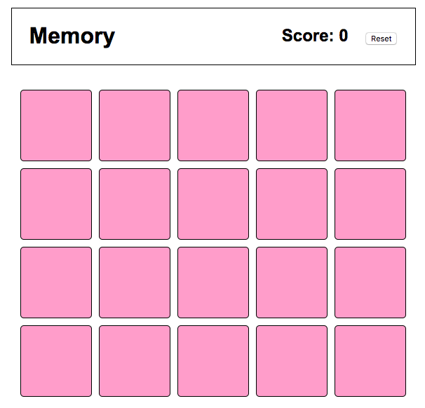
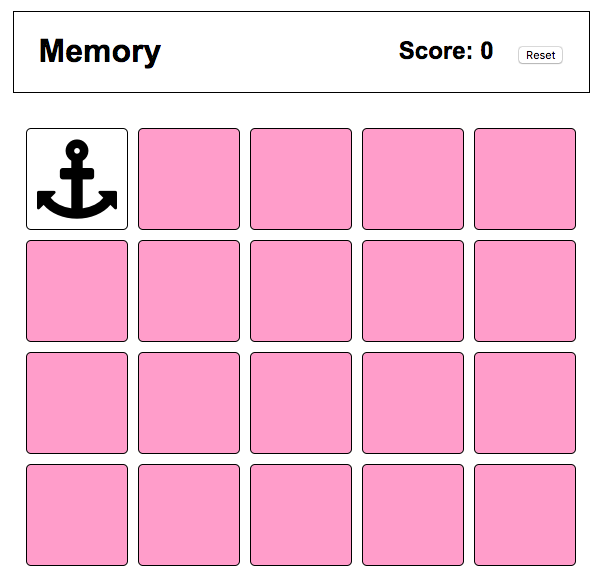

# Memory Game - OOJS

In this challenge you will create a game of Memory.  It is a matching game similar to [this one](http://dkmgames.com/Memory/pairsrun.php).



## Release 0 - Game Setup

To start we will just be working on setting up the game and card objects.  The html and css for the card objects are already provided so it 'looks' like the cards are setup, but we need to represent the cards as an array of card objects loaded into a Game object.  Each card will have an id, a face, and a flip count attribute.  We will use font icons classes for the faces.

When you instantiate your game object, the game should create an array of 10 pairs of cards using 10 font awesome class names for the 'face'.  Choose any 10 font icons that you want. The code below should be a good starting point.

```js
  var game;

  $(document).ready(function(){
    game = new Game();
  });

  var Game = function() {

    function createCards(){

    }

    this.cards = createCards();
  }

  var Card = function(id, face) {

  }
```

## Release 1 - Card Flips

Now that we have the cards loaded into the game object. We need to figure out how to 'flip the cards'. We should define a prototype function on our game object and bind it to a click event on our `.hidden_card` card divs.  The hidden_card CSS class just sets the background color to pink.  This prototype method should remove the pink background and add the font icon HTML to the paragraph inside the div as shown below. Don't worry about un-flipping cards just yet.

```html
  <div><p><i class="fa fa-anchor fa-5x"></i></p></div>
```



## Release 2 - Flipping Pairs & Matching

This is where our game starts to really take shape!  So now we need to add some logic to our card flip handler prototype function and make other single responsibility functions as needed to support this work.

The Game needs a way to keep track of which cards are currently flipped.  Once we have 2, we should check to see if the 2 cards that are currently flipped match!

If the 2 cards match, we need to add a class `.matched_card` to both of the card divs and remove the font icon HTML.  We also need to remove the event handler from the card that was clicked.  We shouldn't be able to click them again after they've been matched.  If you are unsure of how to do this, research the [`off` jQuery method](http://api.jquery.com/off/).

If the cards don't match, we need to remove the font icon HTML and add the `.hidden_card` class back to the div.

## Release 3 - Scoring

- Each time you make a successful match you score 20 points.
- If you fail to find a match and a card the pair was previously flipped, you score (-5 * number of times match tile has been shown). So if a matching tile has been revealed three times before, you will score -15.

You should add single responsibility prototype functions as needed to perform this scoring.  The score span should be updated after each match attempt.

## Release 4 - Resetting Game

Now that the game is over, we should reset it so that we can play again!  The events are now unbound so we need to do all of the following in code:

- remove the `.matched_card` classes from
 the divs and add the `.hidden_card` class to all of them.
- rebind the click event to the `.hidden_card` divs
- change the score back to 0

Are there any refactoring opportunities at this point?  Is your code DRY?

## Stretch - Animate Card Flips

A cool thing to do would be to animate the card flip transitions.  Challenge yourself to see if you can make your memory game a little more fun.
